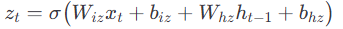
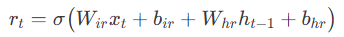
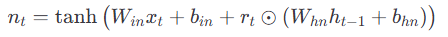
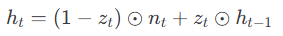

## 

t: 时间步索引

xt: 第t时间步的输入数据(如音频中的第t个采样点). 维度: I * 1 (列向量, I为输入特征维度)

ht: 第t时间步的隐藏状态(GRU的输出, 包含当前时间步的"记忆"). 维度: H * 1(列向量, H为隐藏层维度)

ht-1: 第t-1时间步的隐藏状态(上一时刻的"记忆", 作为当前时刻的输入). 维度: H * 1

## 更新门(zt)公式

zt: 更新门的输出(取值0~1): 控制"保留上一时刻隐藏状态ht-1"的比例(值越接近1保留越多). 维度: H * 1

σ(⋅): sigmoid激活函数, 将值映射到0~1区间. (相当于归一化)

Wz: 更新门的"输入层->隐藏层"权重矩阵(控制输如xt对更新门的影响). 维度: H * I

Rz(W_hz): (hz表示隐藏(h)->更新门(z))更新门的"隐藏层->隐藏层"权重矩阵(控制上一时刻隐藏状态ht-1对更新门的影响). 维度: H * H

bz: 更新门的偏置项(挑战更新门的基线输出). 维度: H * 1

Wz * xt: 输入xt与权重Wz的矩阵乘法(线性变化, 提取输入对更新门的特征). 维度: H * 1

Rz * ht-1: 上一时刻隐藏状态ht-1与权重Rz的矩阵乘法(提取历史记忆对更新门的特征). 维度: H * 1

## 重置门(rt)公式

rt: 重置门输出(取值0~1): 控制"遗忘上一时刻隐藏状态ht-1"的比例(值越接近0, 遗忘越多). 维度: H * 1

Wr: 重置门的"输入层->隐藏层"权重矩阵(控制输入xt对重置门的影响). 维度: H * 1

Rr(W_hr): 重置门的 “隐藏层→隐藏层” 权重矩阵(控制上一时刻影藏状态ht-1对重置门的影响). 维度: H * H

br: 重置门的偏置项(挑战重置门的基线输出). 维度: H * 1

Wr * xt: 输入xt与权重Wr的矩阵乘法(根据重置门的 “功能需求”，对输入数据进行针对性提取). 维度: H * 1

Rr * ht-1: 上一时刻隐藏状态ht-1与权重Rr的矩阵乘法(提取历史记忆对重置门的特征). 维度: H * 1

## 候选隐藏状态(~ht)公式

~ht: 候选隐藏状态(取值-1~1): 基于当前输入xt和"筛选后的历史记忆"计算的新信息. 维度: H * 1

tanh(⋅): 双曲正切集合函数. 将值映射到-1~1区间

Wh: 候选状态的 “输入层→隐藏层” 权重矩阵（控制输入xt对候选状态的影响）. 维度: H × I

Rh: 候选状态的 “隐藏层→隐藏层” 权重矩阵（控制筛选后的历史记忆对候选状态的影响）. 维度: H * H

bh: 候选状态的偏置项(调整候选状态的基线输出). 维度: H * 1

⊙: hadamard积. 两个同维度向量对应位置元素相乘

rt ⊙ ht-1: 重置门对历史记忆的筛选: rt值越小, ht-1中被保留的信息越少. 维度: H * 1

Wh * xt: 输入xt与权重Wh的矩阵乘法(线性变换，提取输入对候选状态的特征). 维度: H * 1

Rh(rt ⊙ ht-1): 筛选后的历史记忆与权重Rh的矩阵乘法(提取筛选后记忆对候选状态的特征). 维度: H * 1

## 最终隐藏状态(ht)公式

ht: 第t时间步的最终隐藏状态: 平衡了"新信息(~ht)"和"旧信息(ht-1)". 维度: H * 1

1 - zt: 与更新门互补的值: 控制保留新信息~ht的比例. 维度: H * 1

(1 - zt) ⊙ ~ht: 新信息的保留部分: 1 - zt越大, 保留的新信息越多.

zt ⊙ ht-1: 旧信息的保留部分: zt越大, 保留的旧信息越多. 维度: H * 1
